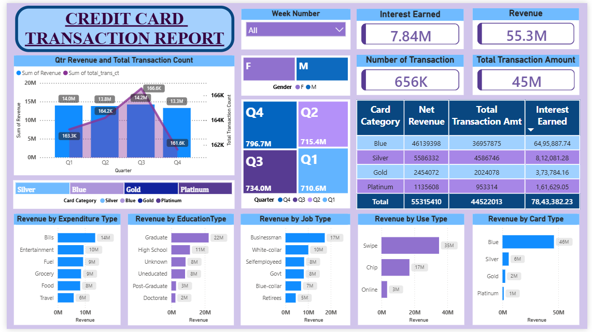
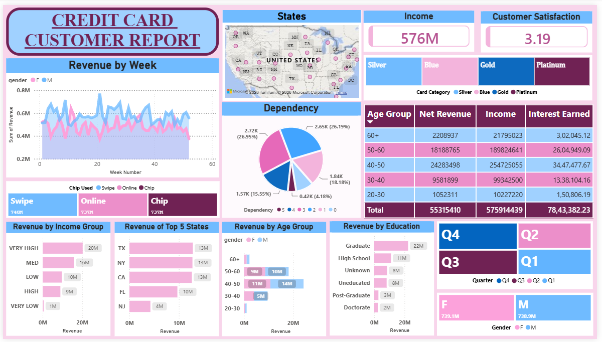
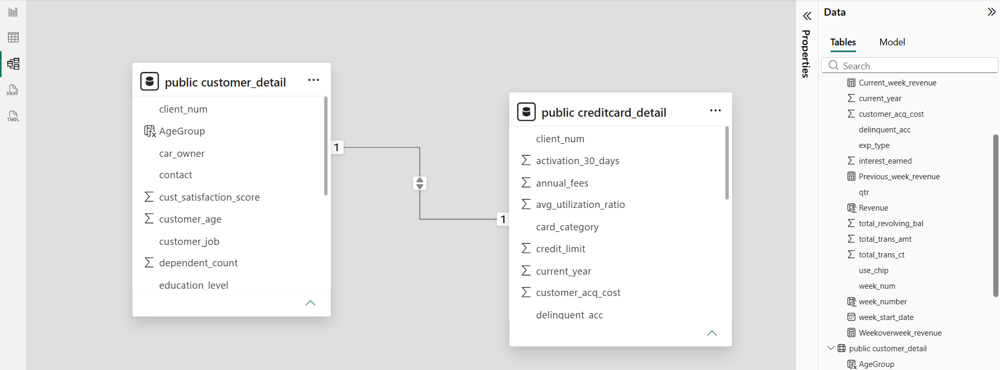
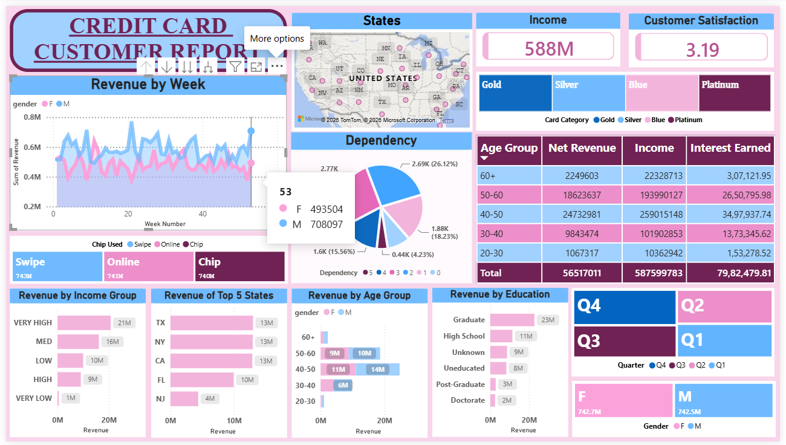

# Credit Card Financial Dashboard

<p align="center">


</p>

---

# Overview

[Credit Card Financial Dashboard](Dashboard/Credit_Card_Financial_Dashboard.pbix)

This project is an **end-to-end Business Intelligence solution** built using **Power BI**, **PostgreSQL**, **SQL**, **Power Query**, **DAX**, and **Microsoft Excel** to analyze credit card customer behavior and transaction performance.

The dashboard provides **real-time weekly insights** into revenue, customer demographics, transaction trends, spending behavior, and financial KPIs. It also demonstrates a production-style workflow by importing raw CSV files into PostgreSQL, building a relational data model, and refreshing Power BI dashboards with newly available weekly data.





---

# Project Highlights

- Built an interactive **Power BI dashboard** with two analytical reports.
- Imported and managed datasets using **PostgreSQL**.
- Loaded CSV files using PostgreSQL's **COPY** command.
- Connected PostgreSQL directly with Power BI.
- Designed a relational data model using **client_num**.
- Created DAX measures for KPI calculations.
- Built dynamic visualizations with slicers and drill-down capabilities.
- Simulated a real-world incremental data refresh by loading **Week 53** data without rebuilding the dashboard.

---

# Project Architecture

```text
                Excel Dataset
                      │
                CSV Conversion
                      │
                      ▼
             PostgreSQL Database
                      │
        ┌─────────────┴─────────────┐
        │                           │
 Customer_Detail             CreditCard_Detail
        │                           │
        └─────────────┬─────────────┘
                      │
                 SQL Queries
                      │
                      ▼
               Power BI Desktop
                      │
      ┌───────────────┴──────────────┐
      │                              │
 Customer Dashboard         Transaction Dashboard
                      │
                      ▼
              Business Insights
```

---

# 🛠 Tech Stack

| Technology | Purpose |
|------------|---------|
| Power BI | Dashboard Development |
| PostgreSQL | Database Management |
| SQL | Data Querying |
| Power Query | Data Cleaning & Transformation |
| DAX | KPI Calculations |
| Microsoft Excel | Raw Dataset |
| CSV | Data Import |

---

# 📂 Repository Structure

```text
Credit-Card-Financial-Dashboard
│
├── Credit_Card_Financial_Dashboard_Report
│   ├── Credit_Card_Financial_Dashboard_Report.pptx
│
├── Dashboard
│   ├── Credit_Card_Financial_Dashboard.pbix
│   ├── Credit Card Customer Dashboard.pdf
│   └── Credit Card Transaction Dashboard.pdf
│
├── Dataset
│   ├── customer.csv
│   ├── credit_card.csv
│   ├── cust_add.csv
│   └── cc_add.csv
│
├── Images
│   ├── customer_dashboard.png
│   ├── transaction_dashboard.png
│   ├── postgresql_import.png
│   ├── data_model.png
│   └── week53_update.png
│
├── SQL
│   └── Sql_Queries.sql
│
└── README.md
```

---

# Data Pipeline

The project uses two relational datasets:

### Customer Dataset
Contains customer demographics including:

- Age
- Gender
- Income
- Education
- Occupation
- State
- Dependents
- Customer Satisfaction

### Credit Card Dataset

Contains transaction information including:

- Revenue
- Interest Earned
- Transaction Amount
- Card Category
- Expenditure Type
- Quarter
- Week Number
- Credit Limit

Both datasets are connected through **client_num**, creating a relational model inside Power BI.



---

# ⚙️ Workflow

### Step 1

Collected raw Excel datasets.

↓

### Step 2

Converted datasets into CSV format.

↓

### Step 3

Created PostgreSQL database and tables.

```sql
CREATE TABLE customer_detail (...);

CREATE TABLE creditcard_detail (...);
```

↓

### Step 4

Imported CSV files using PostgreSQL.

```sql
COPY customer_detail
FROM 'customer.csv'
DELIMITER ','
CSV HEADER;

COPY creditcard_detail
FROM 'credit_card.csv'
DELIMITER ','
CSV HEADER;
```

↓

### Step 5

Connected PostgreSQL with Power BI.

↓

### Step 6

Created relationships and data model.

↓

### Step 7

Built DAX measures and interactive dashboards.

↓

### Step 8

Published business insights through Power BI visualizations.

---

# Incremental Weekly Update (Week 52 → Week 53)
 

The dashboard initially covered data through **24 Dec 2023 (Week 52)**. When **31 Dec 2023 (Week 53)** data became available, it was appended directly into PostgreSQL using two additional CSV files instead of rebuilding the report.

```sql
COPY creditcard_detail
FROM 'cc_add.csv'
DELIMITER ','
CSV HEADER;

COPY customer_detail
FROM 'cust_add.csv'
DELIMITER ','
CSV HEADER;
```

Both files contributed **185 new records**, primarily Blue card customers.

| Metric | Week 52 | Week 53 | Growth |
|---------|---------|---------|---------|
| Total Records | 10,108 | 10,293 | **+185 (+1.83%)** |
| Revenue | $55.32M | $56.52M | **+2.17%** |
| Income | $575.91M | $587.60M | **+2.03%** |
| Interest Earned | $7.84M | $7.98M | **+1.77%** |
| Transaction Amount | $44.52M | $45.53M | **+2.27%** |
| Transactions | 656K | 667K | **+1.68%** |
| Customer Satisfaction | 3.19 | 3.19 | No Change |

After refreshing Power BI, every KPI card, chart, map, and dashboard visual reflected the newly imported records automatically without modifying the data model or report design.

---

# Dashboard Overview

The solution consists of **two interactive Power BI dashboards**, each designed to answer different business questions while sharing a common PostgreSQL data model.

---

## 👥 Customer Report


The Customer Report focuses on customer demographics, income distribution, satisfaction, and revenue contribution across different customer segments.

### Key Metrics

- **Total Income:** $587.6M
- **Net Revenue:** $56.52M
- **Interest Earned:** $7.98M
- **Customer Satisfaction:** 3.19

### Dashboard Features

- Weekly Revenue Trend
- Revenue by Income Group
- Revenue by Age Group
- Revenue by Education
- Revenue by State
- Customer Segmentation
- Dependency Analysis
- Interactive U.S. Map
- Dynamic slicers for Quarter, Gender, and Card Category

---

## 💳 Transaction Report


The Transaction Report provides financial insights into transaction behavior, expenditure patterns, card performance, and quarterly business trends.

### Key Metrics

- **Revenue:** $56.5M
- **Interest Earned:** $7.98M
- **Transaction Amount:** $45.53M
- **Transactions:** 667K

### Dashboard Features

- Quarterly Revenue Analysis
- Revenue by Card Category
- Revenue by Card Type
- Revenue by Expenditure Type
- Revenue by Job Type
- Revenue by Education
- Revenue by Usage Type
- Quarterly Transaction Comparison
- Dynamic slicers for Week Number, Quarter, and Gender

---

# Key Business Insights

The following insights were derived from the complete **10,293-record** dataset after incorporating the Week 53 update.


---

## 💳 Card Portfolio

Blue-tier credit cards account for **83.1%** of total transaction value, followed by Silver (10.2%), Gold (4.6%), and Platinum (2.1%). Revenue is heavily concentrated in the entry-level product, highlighting an opportunity to increase adoption of premium card categories.

---

## 👨‍👩‍👧 Customer Age

Customers aged **40–50 years** contribute the largest share of revenue at **$24.7M (43.8%)**, while the **50–60** age group contributes **$18.6M (32.9%)**.

Together, customers between **40 and 60 years** generate nearly **77%** of total revenue.

---

## 🎓 Education

Graduate customers contribute approximately **$23M (41%)** of total revenue, making them the highest-value education segment.

Revenue decreases significantly for higher education levels such as Post-Graduate and Doctorate, indicating spending behavior is strongest among Graduate customers.

---

## 💳 Transaction Method

Customer spending is dominated by **Swipe transactions (62.6%)**, followed by Chip (31.1%) and Online transactions (6.3%).

This suggests that traditional card-present transactions remain the preferred payment method.

---

## 🛒 Spending Categories

The largest spending category is **Bills (24.5%)**, followed by:

- Entertainment
- Fuel
- Grocery
- Food

Travel contributes the smallest proportion of overall spending.

---

## 💼 Occupation

Businessman customers generate the highest revenue (**$18M**), followed by White-Collar professionals (**$10M**).

These two occupational groups together contribute nearly half of the total transaction revenue.

---

## 🗺 Geographic Distribution

Texas, New York, and California each generate approximately **$13M** in revenue, making them the strongest-performing states in the customer portfolio.

The geographic distribution indicates that business activity is concentrated within a relatively small number of states.

---

## 👥 Gender Analysis

Revenue generated by Female and Male customers is almost identical, indicating a balanced customer base.

Although the overall contribution is nearly equal, weekly trends reveal slight variations between genders throughout the year.

---

## 📈 Quarterly Performance

Quarter 4 is the strongest-performing quarter.

| Quarter | Revenue |
|----------|---------:|
| Q1 | $14.0M |
| Q2 | $13.8M |
| Q3 | $14.2M |
| **Q4** | **$14.5M** |

The higher revenue in Q4 suggests increased customer spending toward the end of the year.

---

## 💰 Income Groups

Customers classified within the **Very High Income** segment contribute approximately **$21M (36.8%)** of total revenue.

This single segment generates more revenue than the combined contribution of the Low, High, and Very Low income groups.

---

# Sample DAX Measures

```DAX
Revenue =
SUM(creditcard_detail[Revenue])

Interest Earned =
SUM(creditcard_detail[interest_earned])

Total Transaction Amount =
SUM(creditcard_detail[total_trans_amt])

Total Transactions =
SUM(creditcard_detail[total_trans_ct])

Customer Income =
SUM(customer_detail[income])

Customer Satisfaction =
AVERAGE(customer_detail[cust_satisfaction_score])
```

---

# Running the Project

1. Clone this repository.

2. Open PostgreSQL (pgAdmin).

3. Create a new database.

4. Execute the SQL script to create the required tables.

5. Import the CSV datasets using the provided SQL `COPY` commands.

6. Open the Power BI (`.pbix`) file.

7. Update the PostgreSQL connection if required.

8. Click **Refresh** to load the latest data into the dashboards.

---

# Skills Demonstrated

- Business Intelligence (BI)
- Power BI Dashboard Development
- SQL & PostgreSQL
- ETL Pipeline Design
- Data Modeling
- DAX
- Power Query
- KPI Development
- Data Visualization
- Incremental Data Loading
- Dashboard Automation
- Business Analytics

---

# Future Enhancements

- Deploy dashboards using **Power BI Service**
- Configure scheduled data refresh
- Add Row-Level Security (RLS)
- Integrate Python-based forecasting models
- Build executive and mobile dashboard layouts
- Connect directly to a live PostgreSQL server for real-time reporting

---

# Author

## **Satyam Anand**

📧 **Email:** satyamanand9555@gmail.com

🔗 **LinkedIn:** https://www.linkedin.com/in/satyam-anand-sa9555/

💻 **GitHub:** https://github.com/Satyamanand1

---

## Support

If you found this project helpful or informative, consider giving the repository a **⭐ Star**.

Your support helps showcase the project and encourages the development of more Business Intelligence and Data Analytics solutions.
